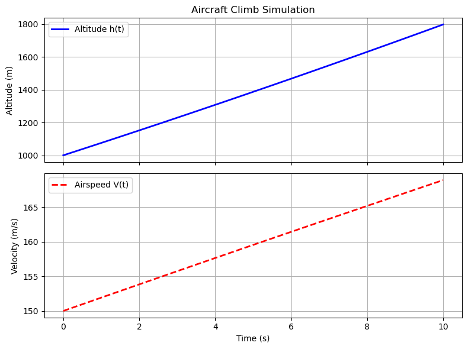
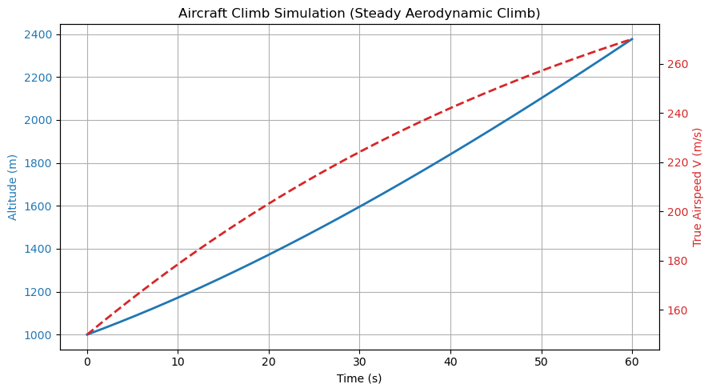
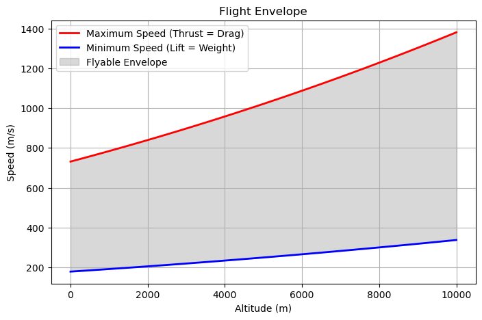
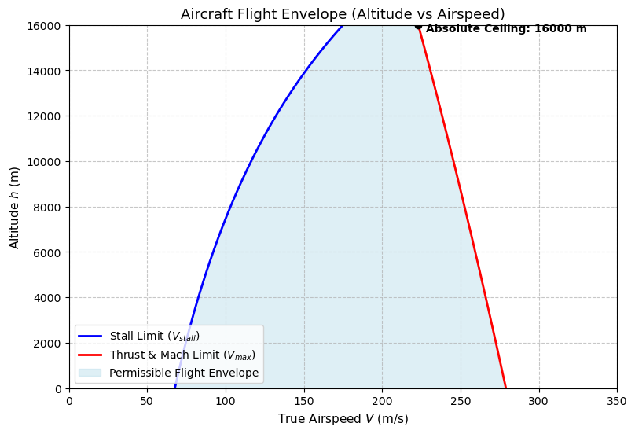

# Flight-performance-simulation
Development of a Python-based aircraft flight-performance simulation tool. 

Sidenote: You maybe have noticed that this entire project is written in Jupyter Notebook file instead of the conventional .py script, this is because I work with mathematical and physical model most of the time, Jupyter notebook has became my main go to option for any python project and its also just easier for me to set up my environment in .pynb format for the IDE I used to program this.

## Claim
* This Capstone project is developed out of my own interest for aircraft simulation before taking any formal course in numerical analysis at university.

* It served as a good practice in building the physics engine from first principle and using data analysis tools for automated testing. The coding of the the physics engine is build under my own knowledge and research of atmospheric physics and python where I have intentionally limited the use of AI until the very last of the validation stage of the project to speed up with data collection and verifying the realism of the model. There are some interest finding here which I will discuss in detail.

---

## Final comment on the results

Something interest I find from the result comparison during the validation stage is how the error result from my simplified assumption lead to the deviation of shape of the flight envelope; below is a side by side comparision of the model I build to a more realist model that Claude code has build for me. There are a few remark to be made here:

# Rate of climb
* The plot from first two image shows a non-linear relation on rate of climb of aircraft.
* Dynamic drag was taken into account in both model, there isn't much difference, except the time scale and parameters are adjusted to make image two look more complete on a large scale showing convergence of the two graphs.

# Flight Envelope(the more interesting part)
* The complexity and axis layout of third and fourth image are difference, but they fundamental depict the same thing, namely the range of speed on each altitude.
* The relation in fourth image is non-linear, which depicts a more accurate model in most case. In third image T_0 is held constant and rho (air density) is in the denominator, V_max will continuously increase as the air gets thinner at higher altitude. Something I have missed here; mach limit and thrust lapse rate was not taking into account.
* Thrust lapse rate: Thrust drops significantly as the air thins out because there is less oxygen for combustion.
* Mach limit and wave drag: In reality, as an aircraft approaches the speed of sound (which drops at higher, colder altitudes), the drag coefficient spikes exponentially due to compressibility and shock waves. Adding a Mach limit or making dc a function of velocity would force the maximum speed curve to bend backward at high altitudes. Hence contributing the converging plot you see in four.
  
* An interest fact I found was that for a typical 747 flight a converging envelope is a better model, but for rocket flight simulation, my model would make a better approximation, because rockets carry their own oxidizer and do not rely on atmospheric oxygen. Their thrust does not drop as the air gets thinner; in fact, rocket thrust slightly increases at higher altitudes due to a lack of atmospheric backpressure. Because thrust remains dominant while aerodynamic drag rapidly decreases in thin air, the vehicle's maximum speed would continually increase as it climbs, curving the graph upward.

## Project Goals

The simulator will be developed to model:

* Atmospheric conditions at different altitudes
* Lift and drag
* Aircraft stall speed
* Engine thrust
* Thrust and drag relationships
* Climb performance
* Aircraft acceleration
* Flight envelope
* Time-dependent flight behaviour

---

## Project Development Stages

### Step 1. Atmosphere Model

Create a model that calculates atmospheric temperature, pressure and density at different altitudes.

The results will be visualised to investigate how atmospheric conditions change with altitude.

### Step 2. Aerodynamic Model

Implement simplified models for aircraft lift and drag.

The model will be used to investigate how aerodynamic forces change with:

* Airspeed
* Air density
* Angle of attack
* Aircraft configuration

### Step 3. Aircraft Model

Create an aircraft model containing parameters such as:

* Mass
* Wing area
* Aspect ratio
* Maximum lift coefficient
* Drag parameters
* Engine thrust

### Step 4. Stall Speed

Use the aerodynamic model to calculate stall speed and investigate how it changes with:

* Aircraft mass
* Altitude
* Maximum lift coefficient

### Step 5. Engine Model

Implement a simplified engine thrust model.

The initial model will focus on how available thrust changes with altitude, velocity and throttle rather than attempting to reproduce the detailed thermodynamics of a real engine.

### Step 6. Aircraft Performance

Compare available thrust with aerodynamic drag to investigate:

* Equilibrium speeds
* Maximum speed
* Excess thrust
* Acceleration

Numerical root-finding methods will be used to solve for equilibrium conditions.

### Step 7. Climb Performance

Calculate aircraft rate of climb and investigate how climb performance changes with:

* Altitude
* Airspeed
* Aircraft mass
* Throttle

### Step 8. Flight Simulation

Introduce ordinary differential equations to simulate aircraft motion over time.

This will allow scenarios such as acceleration and climbing to be simulated numerically.

### Step9. Flight Envelope

Use the performance model to estimate the range of speeds available to the aircraft at different altitudes.

The results will be visualised as a flight-envelope diagram.

### Step 10. Validation

The final model will be compared against published performance data from a real aircraft.

Differences between the model and reference data will be analysed to identify limitations in the simplified model.

---

## Numerical Methods

Numerical methods will be used throughout the project, including:

* Root finding
* Numerical integration
* Optimisation
* Interpolation
* Error analysis

---

## Requirements

* Python
* NumPy
* SciPy
* Matplotlib
* Pandas

## Potential Future Development

Possible future improvements include:

* More realistic and complete engine modelling for aircraft dynamics
* Mach-number-dependent aerodynamics
* Improved atmospheric modelling
* Control-surface modelling
* Sensitivity analysis
* Comparison with CFD results
* Integration with OpenFOAM

